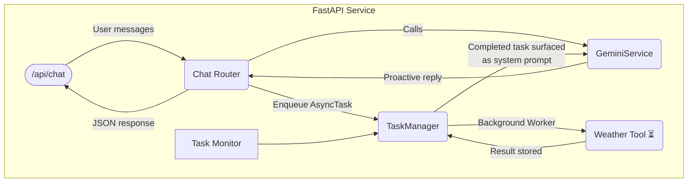

# Async-Agent Example: Conversational AI with Background Tool Execution


> A proof-of-concept showing how an AI assistant can keep the conversation flowing while running long-lived tasks in the background — and then *proactively* weave the results back into the chat when they are ready.

---

## ✨ Why this project?

Large-language-model (LLM) agents are great at answering questions *now*, but real world workflows often require them to:

1. Recognise **when** to call an external tool (API, DB query, scraper, …).
2. Wait minutes (or hours) for the result.
3. Keep chatting naturally in the meantime.
4. Seamlessly introduce the answer later *without repeating themselves*.

This repository demonstrates exactly that using:

* **Google Gemini** via the beta GenAI SDK
* **FastAPI** for the HTTP interface
* A tiny **task queue / worker** implemented with nothing but `asyncio`
* An example **weather tool** that simulates a 15-second API call
* Extensive **pytest** scripts that verify the behaviour end-to-end

---

## 🏗️  High-level architecture



* **Chat Router:** handles incoming messages, keeps an in-memory chat history per user and detects tool calls.
* **GeminiService:** wraps the GenAI SDK — converting chat history & tool definitions into the format Gemini expects and parsing responses (including function-call requests).
* **TaskManager:** lightweight queue + worker. Long-running tools are executed in the background; results are persisted in memory.
* **Task Monitor:** periodic coroutine that logs metrics and makes sure the worker stays alive.
* **Weather Tool:** a dummy function that sleeps for 15 s and then returns a hard-coded forecast.

When Gemini returns a `get_delayed_weather` tool call the router immediately acknowledges the user (“I’m fetching the weather…”) and lets them keep chatting. Once the worker finishes, the result is injected back into the conversation as a *system* message so the next Gemini response can naturally mention it using phrases like “By the way, regarding the weather you asked about earlier…”.

---

## 🚀 Quickstart

### 1. Clone & install

```bash
# Using Poetry (recommended)
poetry install
poetry run uvicorn app.main:app --reload

# or plain venv + pip
python -m venv .venv && source .venv/bin/activate
pip install -r requirements.txt
uvicorn app.main:app --reload
```

Environment variables can be placed in a `.env` file (see `.env.example`). You *must* provide `GOOGLE_API_KEY` for Gemini.

### 2. Talk to the bot

```bash
curl -X POST http://localhost:8000/api/chat \
  -H "Content-Type: application/json" \
  -d '{"user_id": "my-user", "message": "Hello, can you get me the weather for London?"}'
```

Open `http://localhost:8000/docs` for the interactive Swagger UI.

### 3. Run the demo test

```bash
python test_proactive_results.py
```

You should see output similar to the transcript in the repository description.

---

## 🧪 Running the full test suite

```bash
pytest -q
```

All tests are asynchronous ‑ they spin up the FastAPI app, simulate a conversation, and assert that:

* normal questions are answered immediately;
* Gemini requests the weather tool;
* the assistant does **not** block while the 15 s task runs;
* once the task completes, the result is mentioned exactly once.

---

## 📂 Project layout

```
async-agent-example/
├─ app/
│  ├─ core/            → settings & constants
│  ├─ models/          → Pydantic schemas
│  ├─ routers/         → FastAPI endpoints
│  ├─ services/        → Gemini wrapper + task manager
│  └─ tools/           → external tool interfaces
├─ tests/              → pytest cases (see *test_*.py*)
├─ run.py              → convenience startup script
└─ README.md           → you are here 😊
```

---

## 🔒 Limitations & next steps

* **In-memory storage** — swap in Redis or a real queue (RQ, Celery, Sidekiq-py) for production.
* **Single process** — no horizontal scaling yet.
* **Error handling** is minimal.
* **Streaming responses** / WebSockets would make the UX even smoother.

Pull requests are very welcome! 🙌

---

## 🤝 Contributing

1. Fork the repo & create a branch (`feat/my-awesome-feature`).
2. Run `pre-commit install` to enable hooks.
3. Add your changes & tests.
4. Ensure `pytest` and `ruff` pass.
5. Open a PR — please describe *why* as well as *what*.

All contributors agree to abide by the [Contributor Covenant](https://www.contributor-covenant.org/version/2/1/code_of_conduct/).

---

## 📝 License

This project is licensed under the MIT License — see [LICENSE](LICENSE) for details.

---

## 🙏 Acknowledgements

* [FastAPI](https://fastapi.tiangolo.com/)
* [Google GenAI SDK](https://ai.google.dev/)
* Inspiration from the OpenAI function-calling examples and the community discussion around *agents that don’t block the user experience*.

---

Happy hacking! ✨